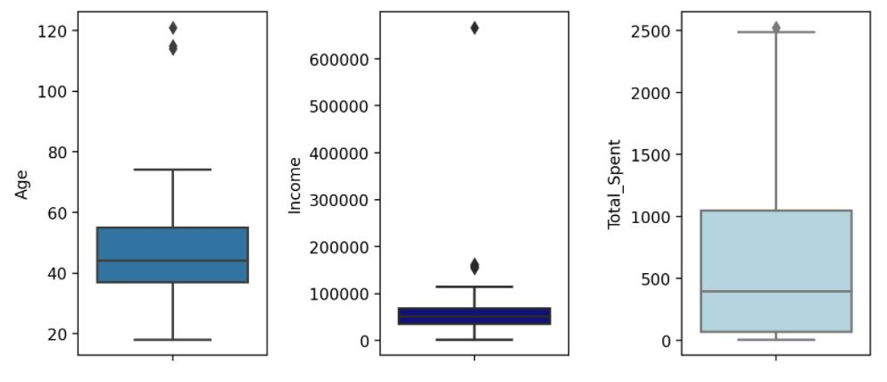
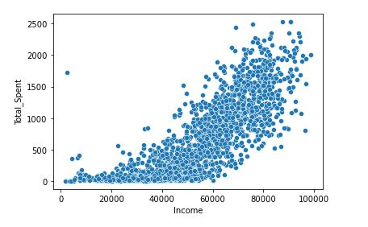
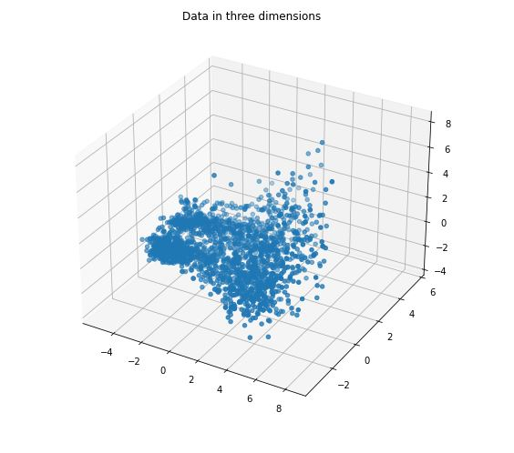
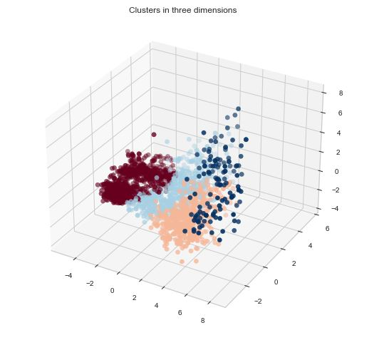
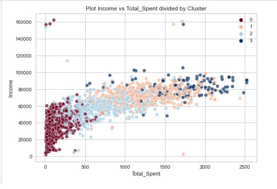

Jupyter Notebooks:

[Part 1 Exploratory Data Analysis](https://github.com/VictorDonjuan/Customer_Segmentation_ML/blob/main/Part%201%20EDA%20and%20Data%20Cleaning%20.ipynb)

[Part 2 Clustering and Customer Analysis](https://github.com/VictorDonjuan/Customer_Segmentation_ML/blob/main/Part%202%20Clustering%20and%20Customer%20Analysis%20.ipynb)

# Customer Segmentation Clustering Project: Overview

Customer segmentation (or customer personality analysis) is the process of dividing customers into groups on common characteristics, such as demographics characteristics or buying behaviors. In this project, we analyze a [dataset](https://www.kaggle.com/imakash3011/customer-personality-analysis) from an anonymized company in the US that has collected many such features from its customers, such as age, education, marital status, income, amount spent on their products and whether or not they have responded positively to marketing campaigns and deals. The goal is to use Clustering Machine Learning Techniques in order to find the best customer segmentation, and then find and analyze what characteristics those clusters have in common.

# Exploratory Data Analysis and Data cleaning

The dataset consists of 2240 observations with 26 features. Since this is an Unsupervised Learning task, there's not response variable.

In the first part, we perform a Data Analysis in order to understand the distrubution of the features. For example, we analyze the distribution of the ages, incomes and amount spent of the observations:

We can see that 'Age' and 'Income' have some outliers that had to be removed. On the other hand, a positive (and expected) correlation was found between Total_Spent and Income:

# Clustering and Results

In Part 2, since there are many features, we first performed PCA (Principal Component Analysis) in order to reduce the dimension of the dataset to only 3.

Then, we trained an Agglomerative Clustering model on this three dimensional data, and obtained the following 4 clusters:

After this, we performed the Customer Analysis to find the characteristics that these clusters have in common. For instance, the relation between the clusters and income vs total_spent can be seen in the following scatterplot. 

Thus a clear segmentation can be obtained from here. For example, Cluster 1 has less income and total_spent that the other ones whereas Cluster 3 has the highest income and the highest total spent. At the end of the analysis, we found the following characteristics:

Cluster 0:

- It's the most prevalent Cluster.
- Has the least Income and Total_Spent.
- Doesn't make a lot of purchases in general.
- Visits the website more than the others.
- Slithly younger then the others.
- Usually has one or more kids.
- Responds only to a few marketing campaigns.
- Its 'Education' feature is pretty mixed.

Cluster 1:

- Ranks 2nd in Income and Total_Spent.
- Slightly older than Cluster 0.
- Doesn't make a lot of purchases with discounts.
- Buys mostly from the Catalog and the Store.
- Doesn't buy much from the website.
- Doesn't spend much time on the website.
- Doesn't usually have kids, but can have teenegers.
- Sometimes responds to the marketing campaigns.
- It's the Cluster with highest percentage of Graduates.

Cluster 2:
 
 - Ranks 3rd in Income and Total_Spent.
 - Tends to be older than all of the other Clusters.
 - It's the one who makes the most purchases with discounts.
 - Usually vistis the website.
 - Usually buys from the website.
 - Doesn't usually buy from the Catalog.
 - Sometimes buys at the Store.
 - It's the cluster with more teenagers than the other ones.
 - Sometimes reponds to the marketing campaigns.
 - Best education, with almost half of them being Postgraduates.
 
Cluster 3:
 - The least prevalent Cluster of all.
 - Highest Income and Total_Spent.
 - Balanced age.
 - Doesn't tend to have kids nor teenagers in their household.
 - Buys from the Store, Catalog and Website, but doesn't visit the website a lot.
 - Doesn't seem to make a lot of purchases with discounts.
 - Highest response to the marketing campaigns.
 - Ranks 2nd in Education.
